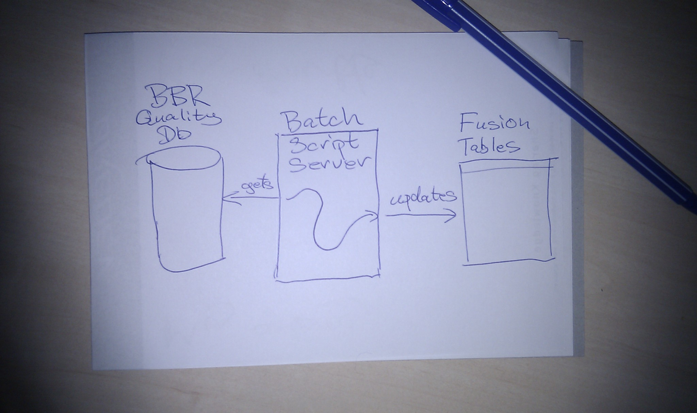
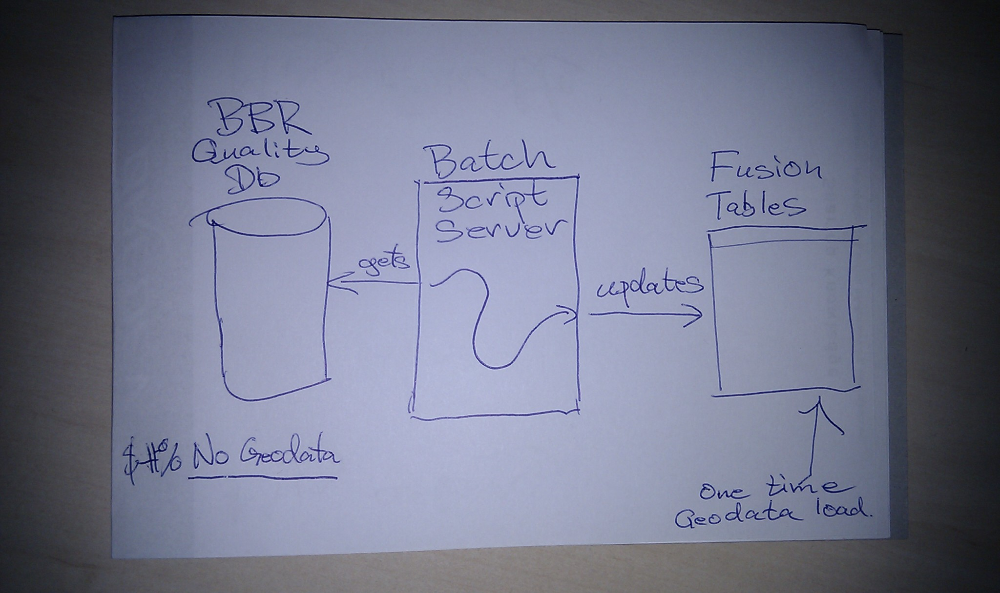
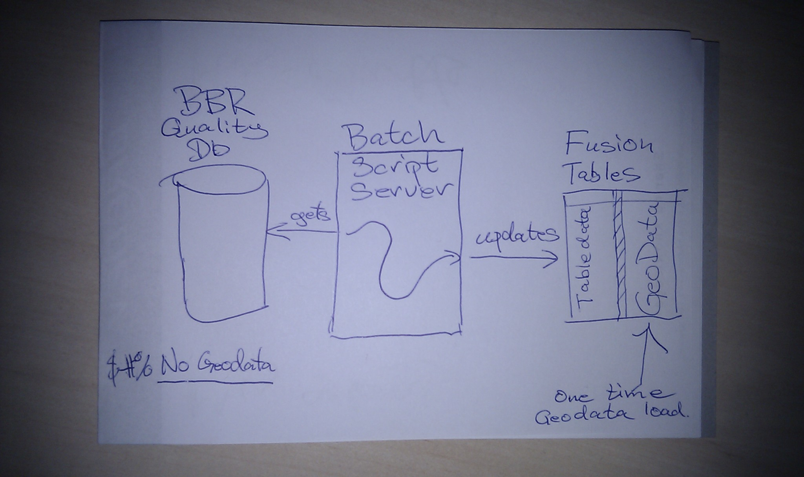
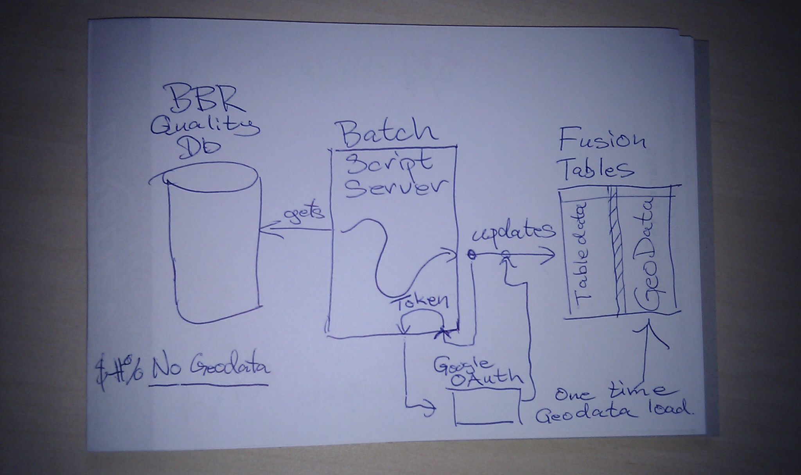
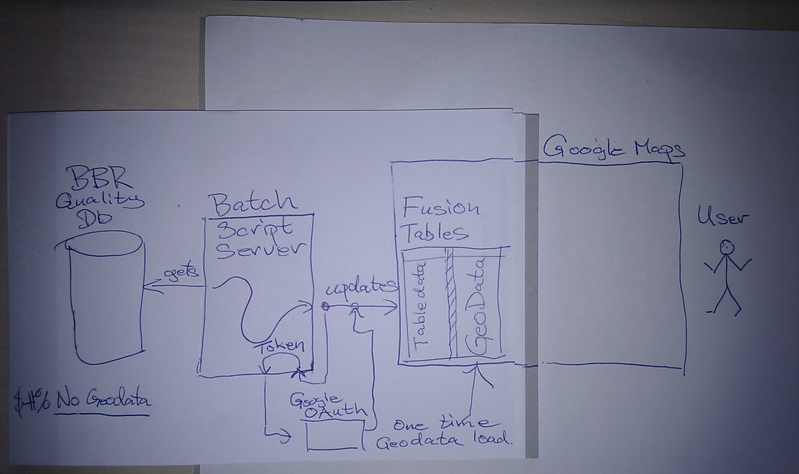
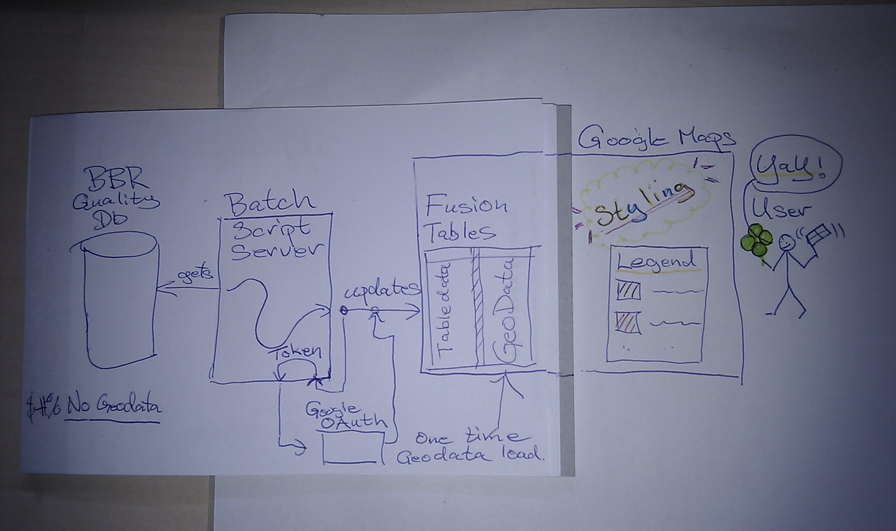

### "Visualizing data on maps using Googles Fusion Tables and the Google Maps API"

!

Short title:
### How can you use Fusion Tables?

!

### Steen Hulthin Rasmussen

#### Freelance code monkey
##### and chocolate lover

***
> `twitter: @steenhulthin`
>
> `blog: steen.hulthin.dk/blog`

!

The 2-minutes Version
---------------------

Google Maps is digital maps...

Fusion tables is a table store with built-in interactions with Google Maps (and Google Chart tools)

Let's see that in action!

!

#### "We added maps to our website ... with no extra maintance cost."

> _official at MBBL*_ 

###### _* Ministry of Housing, Urban and Rural Affairs_

#### "It's Cloud and totally Web Scale!"

> _A hipster on the internet_

!

My story... (1)
===============

MBBL requirements:

1. Visualise data quality of BBR* on maps
2. Low/no server maintance cost

> *BBR is a database containing all building and addresses in Denmark

!

My story... (2)
===============

* Some knowledge of Fusion Tables with Google Maps from abandoned project:
[postnummerkortet.dk](http://postnummerkortet.dk/version2/)
* BBR data quality data available 
* No server cost (for small sites)

Ok, ready as can be!

!

Architechture draft
-------------------

!

Revised architechture
---------------------

!

Stumbling Block 1
-----------------

Getting geodata into a Fusion Table 

Fusion tables only support one geodata format: kml

> tips: [http://www.shpescape.com/](http://www.shpescape.com/) and Quantum GIS

!

New architechture
-----------------

!

Stumbling Block 2
-----------------

Signing up for Google APIs. 

Here it is: [http://code.google.com/apis/console](http://code.google.com/apis/console)

Or on [https://developers.google.com/](https://developers.google.com/) find `API Console` under `Developer Tools` (if you can)

For read-only access a `Simple API Access` is fine

For read-write a `client ID` is necessary

Let see that.

!

Fusion Tables API
-----------------

Quite simple SQL-ish API

- Base API is http-based
- Bindings in many languages (not all complete)
- Bulk update restrictions *

> _* `Delete` old and `Add` new works faster than `Update`_

!

Stumbling Block 3
-----------------

Write access requires user accept.

OAuth is not super simple!

Requires manual interaction the first logon.

Subsequent requests can be made with a refresh token.

`code?`

!

Architecture with OAuth
-----------------------

!

Stumbling Block 3
-----------------

Traffic limits

Fusion Tables restrictions:

- 25000 requests / day 
- "Invisible" limits on req/s
- Setting req/s limits is NOT foolproof

Solution: Throttle down request rate
> also called: `Thread.Sleep(500)`

!

Stumbling Block 4
-----------------

Fusion Tables are not perfect:
* No legends
* Unexplainable/unexpected behaviour
* Limited control over map feature styling

Google Maps to the rescue!

!

Google Map API
--------------

- Feature rich Javascript API
- Integrates very well with Fusion Tables

!

Architecture with Google Maps
-----------------------------

> Fusion Tables styling is gone...

!

Architecture with Google Maps
-----------------------------

> But can be added in Google Maps!

!

The final result
----------------

Traffic lights grouping of all municipalities

One example:
[http://percipio.dk/arealligningvilla/](http://percipio.dk/arealligningvilla/)

!

!

Thanks

@steenhulthin

phone: +45 27 28 99 69

Slides: 
